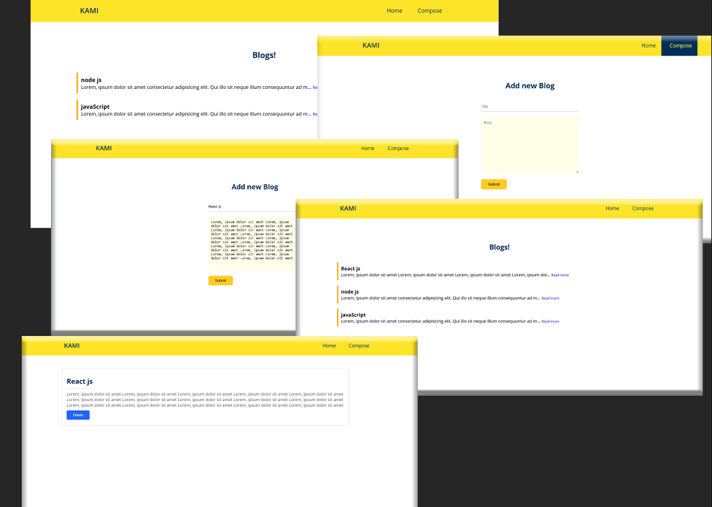

# Blog Project

A simple blog built with Node.js and MongoDB. This project allows users to create, delete, and manage blog posts.

## Features
- Create, and delete blog posts
- Categorize and tag posts
- Admin panel for managing content



## Installation
```bash
git clone https://github.com/yourusername/blog-project.git
cd blog-project
npm install
npm start
```

## Environment Variables
Create a `.env` file and add the following variables:
```env
MONGO_URI=mongodb://localhost:27017/blog
JWT_SECRET=your_secret_key
PORT=3000
```

## Project Structure
```
/blog-project
│-- server.js
│-- package.json
│-- /routes
│-- /models
│-- /views
│-- /public
```

## Commands
- `npm run dev` - Run the server in development mode
- `npm start` - Run the server normally

## License
This project is licensed under the MIT License.

## Contact
For any inquiries, feel free to reach out to me at [@tesakor].
